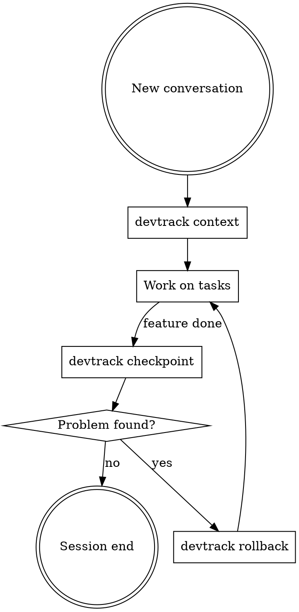

# dev-tracker: Development State Tracking

## Overview

Automated development state tracking with checkpoint-based rollback. Replaces manual handoff documents and rollback packages with a unified, scriptable system.

## When to Use

- **New conversation**: Run `devtrack context` to load current project state
- **After completing work**: Run `devtrack checkpoint <label>` to snapshot
- **Need to undo**: Run `devtrack rollback <checkpoint>` to restore
- **Resuming work**: Run `devtrack status` to see where things stand

## Quick Reference

| Command | Purpose |
|---------|---------|
| `devtrack init` | Initialize tracking for a project |
| `devtrack checkpoint <label>` | Create a named checkpoint (code + state + remote) |
| `devtrack context` | Generate AI-readable context summary |
| `devtrack status` | Show current development state |
| `devtrack diff [checkpoint]` | Compare current state against a checkpoint |
| `devtrack rollback <name>` | Restore to a checkpoint (supports `--dry-run`) |
| `devtrack session start` | Begin session recording |
| `devtrack session end [summary]` | End session, archive log |

All scripts live in `~/.claude/skills/dev-tracker/scripts/`.

## Workflow

## AI Integration Rules

1. **Session start**: Always run `devtrack context` at conversation start if `.devtrack/` exists
2. **Auto-suggest checkpoint**: After completing any feature/fix, suggest `devtrack checkpoint`
3. **Before risky changes**: Suggest checkpoint before modifying production configs or remote servers
4. **Session end**: Run `devtrack session end` with a brief summary of what was accomplished

## State Files

- `.devtrack/config.yaml` — project configuration (tracked paths, remote servers, build commands)
- `.devtrack/state.yaml` — current development state (tasks, focus, blockers, decisions, risks)
- `.devtrack/timeline.yaml` — ordered event log
- `.devtrack/context.md` — auto-generated AI context summary

## Checkpoint Contents

Each checkpoint in `.devtrack/checkpoints/<timestamp>-<label>/` contains:
- `manifest.json` — file inventory with SHA-256 checksums (local + remote)
- `state.yaml` — development state snapshot
- `originals/` — backup copies of all tracked files
- `rollback.sh` — auto-generated restore script (`--dry-run` / `--apply`)
- `verify.sh` — auto-generated post-rollback verification
- `summary.md` — human/AI readable checkpoint description

## Common Mistakes

- Forgetting to run `devtrack context` in a new conversation (loses continuity)
- Creating checkpoints without meaningful labels (hard to identify later)
- Running `rollback --apply` without `--dry-run` first on remote resources
